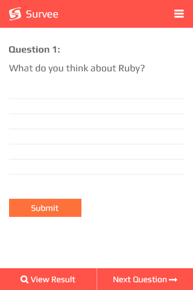
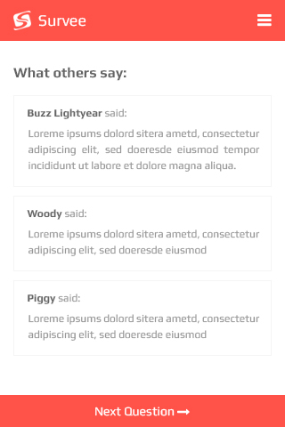
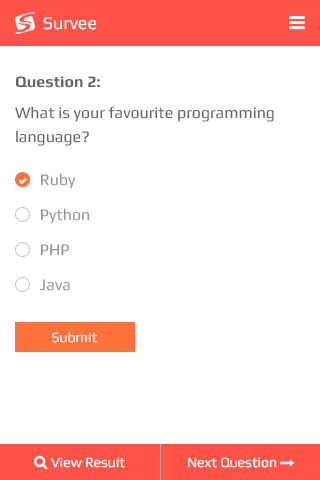
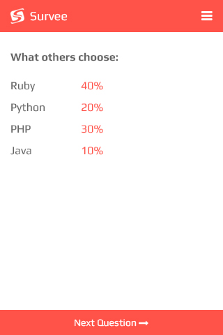
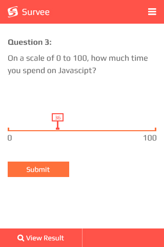
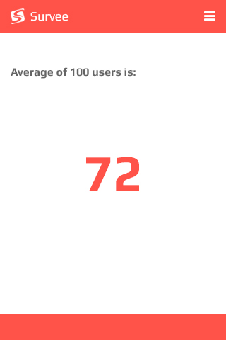

# Survee API Server
This is a Ruby evaluation test to create a single serving website that allows a group of users to RSVP their attendance for an event.

## Requirements
Survee is a mobile app that let users take a survey.
This test is to build an API server to support the survee mobile app.
The API server will store the questions, answers and provide reporting information.

You will decide the API endpoints and how the API will be used.

You must provide the following APIs:
- to retrieve a question
- to add an answer to the the question
- to provide reporting for a question's results

Assume that the questions are already created on the server.
More question types are expected to be added in the future.

There are currently 3 type of questions:  
## 1) Open-text Question  
This question accepts a single open text answer:

For reporting, the API will respond with a list of all the answers by all users:

## 2) Multiple Choice Question  
This question has a list of choices and will only accept one choice per answer:

For reporting, API will respond with the percentage chosen for each choice:

## 3) Scale Question
This question has a minimum and a maximum scale value for the answer. eg. 0 to 100:

For reporting, question will respond with the the average of all answers:

The initial data for the app are given at the end of this README.

## Technical Note
All mobile devices have a unique ID called UDID. You should use this to differentiate your users.  
API must be RESTful and use JSON.  
API should returns JSON error messages in errors or exceptions.  
API do not need to implement oauth or security features.  

## Rules
Please refer to the [rules](https://github.com/futureworkz/playbook/tree/master/protocols/ruby-evaluation-test#rules) in our playbook.

## Submission of Work
Please refer to our [submission of work](https://github.com/futureworkz/playbook/tree/master/protocols/ruby-evaluation-test#submission-of-work) in our playbook.

## Questions
What do you like about Ruby?

Which is your favourite programming language?
- Ruby
- Python
- PHP
- Java

On a scale of 0 to 100%, how much time do you spend on Javascript?
0 to 100
